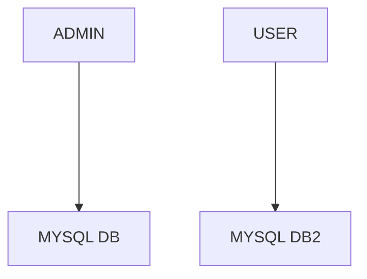
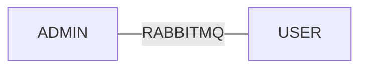

# ECOMMERCE APPLICATION

This is a microservice application with the admin developed in Django, and the main app
developed in Flask.

The two applications are connected using an online RabbitMQ broker.




Each app is containerized in a docker-compose.yaml file.

Tools: `podman`, `podman-compose`, and `python`

#Endpoints:


Products
- 
  - **Endpoint** ``GET`` `/api/products`
  - Get all products. 
  - It takes no parameter.
  - **STATUS CODE** ``200``


- 
    - **Endpoint** ``POST`` `/api/products`
    - Create a Product.
      - **Body**: A `json` object.
      - This is required.
      - Example: 
        ```json
          {
            "title": "ade",
            "image": "old image"
          }
        ```
  - **STATUS CODE** ``201``


- 
  - **Endpoint** ``GET`` `/api/products/<id>`
  - Get product with specific id.
  - **id**: string
    - The ID of the element. It is required.
    - example: 1 
  - **STATUS CODE** ``200``


- 
  - **Endpoint** ``PUT`` `/api/products/<id>`
  - Update all the fields in product.
  - **id**: string
    - The ID of the element. It is required.
    - example: 1 
  - **Body**: A `json` object.
      - This is required.
      - Example: 
        ```json
          {
            "title": "ade",
            "image": "old image"
          }
        ```
  - **STATUS CODE** ``202``


- 
  - **Endpoint** ``PATCH`` `/api/products/<id>`
  - Update partial data for product.
  - **id**: string
    - The ID of the element. It is required.
    - example: 1 
  - **Body**: A `json` object.
      - This is required.
      - Example: 
        ```json
          {
            "title": "ade"
          }
        ```
  - **STATUS CODE** ``202``


- 
  - **Endpoint** ``DELETE`` `/api/products/<id>`
  - Delete product with id.
  - **id**: string
    - The ID of the element. It is required.
    - example: 1
  - **STATUS CODE** ``204``


User
- 
  - **Endpoint** ``GET`` `/api/user`
  - Get a random user.
  - **STATUS CODE** ``200``


To get started:
-

- Clone the repository


- Setup and Activate virtual environment
```shell
    python3 -m venv venv/
    source venv/bin/activate
```

- Install dependencies
```shell
    pip install -r requirements.txt
```

- Change to the admin directory and run the admin app
```shell
  cd admin
  podman-compose up
```

- Change to the main directory and run the user app
```shell
  cd main
  podman-compose up
```
NOTE: The setup process also works for `docker`.